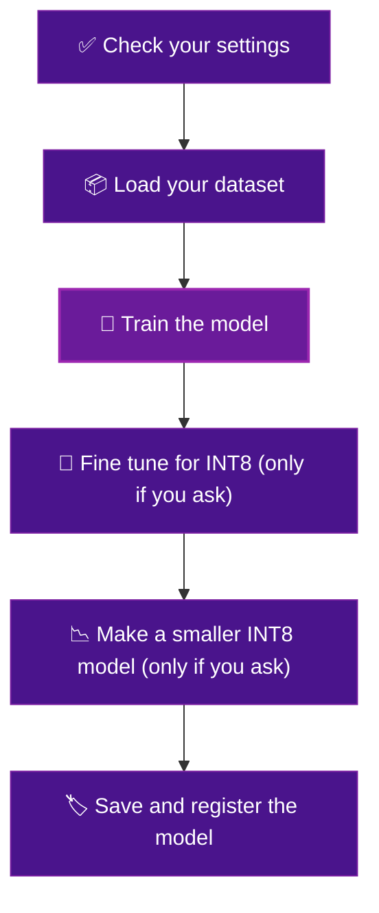

# Welcome

This is your guide to running the **YOLO training pipeline**.

The pipeline is already built. You do not write code. Your job is to give it a dataset, pick a few options on a web form, and press Submit. It then trains a model for you on real machines, and saves the results so you can look at them.

This guide takes you through the whole thing, one small step at a time. It is written for someone who has never done this before.

## What the pipeline does

It runs six steps in order. Each step hands its work to the next one.

Steps four and five only run if you turn on quantization. If you leave it off, the pipeline trains a model and saves it. That is the simple path, and it is a fine place to start.

## What you will do

- :material-book-open-variant: **Start here**

    ---

    Get access and learn what each step does. First time through, read these in order.

    [:octicons-arrow-right-24: What you need](what-you-need.md)

- :material-database-arrow-up: **Upload your dataset**

    ---

    Put your images and labels where the pipeline can read them.

    [:octicons-arrow-right-24: Upload your dataset](upload-dataset.md)

- :material-play-circle: **Run the pipeline**

    ---

    Open the form, pick your dataset and model, set a few options, press Submit.

    [:octicons-arrow-right-24: Run the pipeline](run-it.md)

- :material-chart-line: **Read your results**

    ---

    See the numbers and charts from your training run.

    [:octicons-arrow-right-24: Read your results](results.md)

## Who this is for

You do not need to be an engineer. If you can fill in a web form and follow steps in order, you can run a training job. Start with [What you need](what-you-need.md).

!!! tip "New words"
    If you hit a word you do not know, check the [Word list](glossary.md). Each term is explained in one plain sentence.
