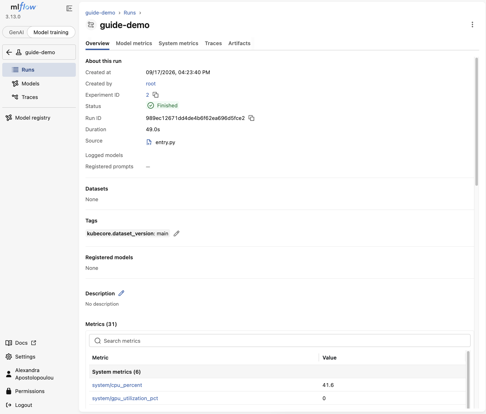
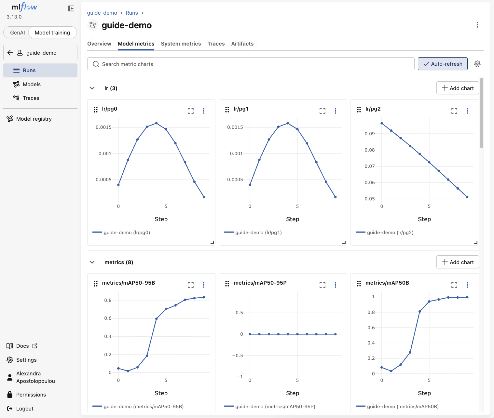
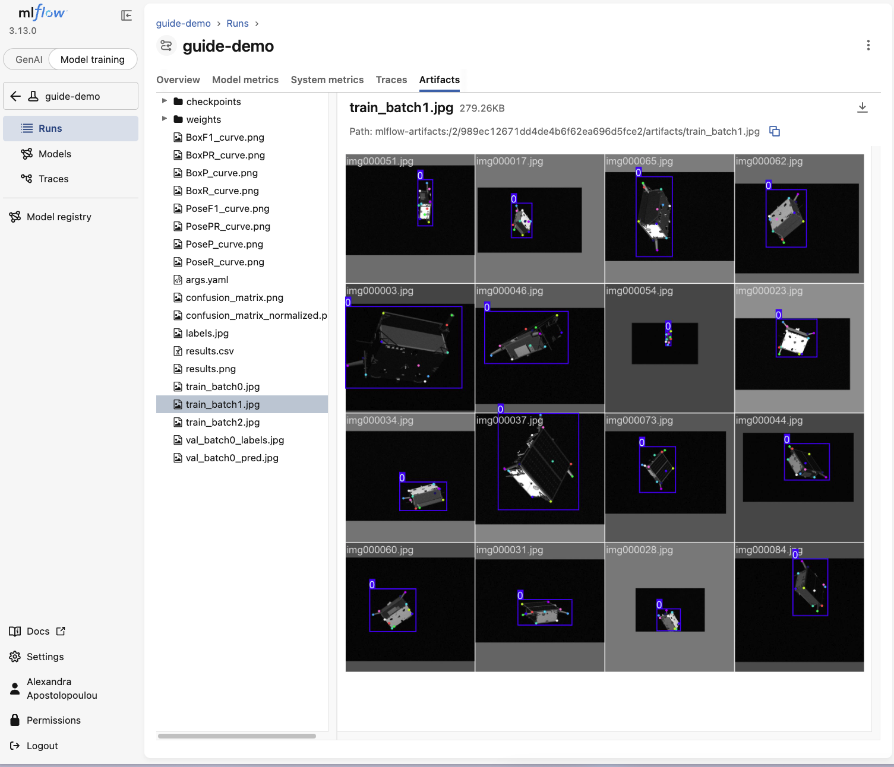

# Read your results

Every run records its numbers and charts on a page called MLflow. This is where you go to see how your training went.

## Open MLflow

Your platform contact gives you the link to MLflow. Open it in your browser.

Find your run by the name you set in `experiment-name`. Click it to open it.

## What you will see

A run holds a few kinds of things.

- **Metrics.** Numbers that say how good the model is, and how they changed over the training rounds. You will see them as charts that move as training goes on.
- **Parameters.** The exact settings this run used. Every field you set on the form is saved here, so you always know what produced a result.
- **Artifacts.** The files the run produced, including the trained model and some example outputs.

The artifacts include example images with the model's predictions drawn on, so you can see at a glance what it learned.

## Comparing runs

Because every run saves its settings and its numbers, you can line two runs up side by side. Train once with a small model, once with a bigger one, and compare. Change the epochs and compare again. This is how you learn what works for your data.

MLflow has a compare view for exactly this. Select two or more runs, and it shows their numbers together.

## Why the settings are saved

You never have to remember what you did. If a run turns out well, its parameters are right there. You can read them, and set the same values again to repeat it. If a run turns out badly, you can see what to change.

Happy with a model? Go to [Promote a model](promote.md).
