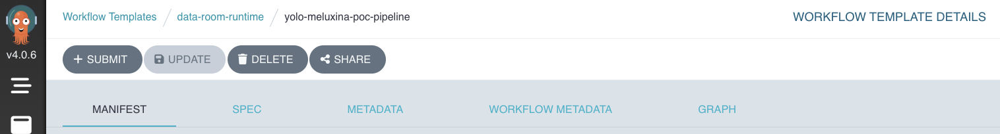
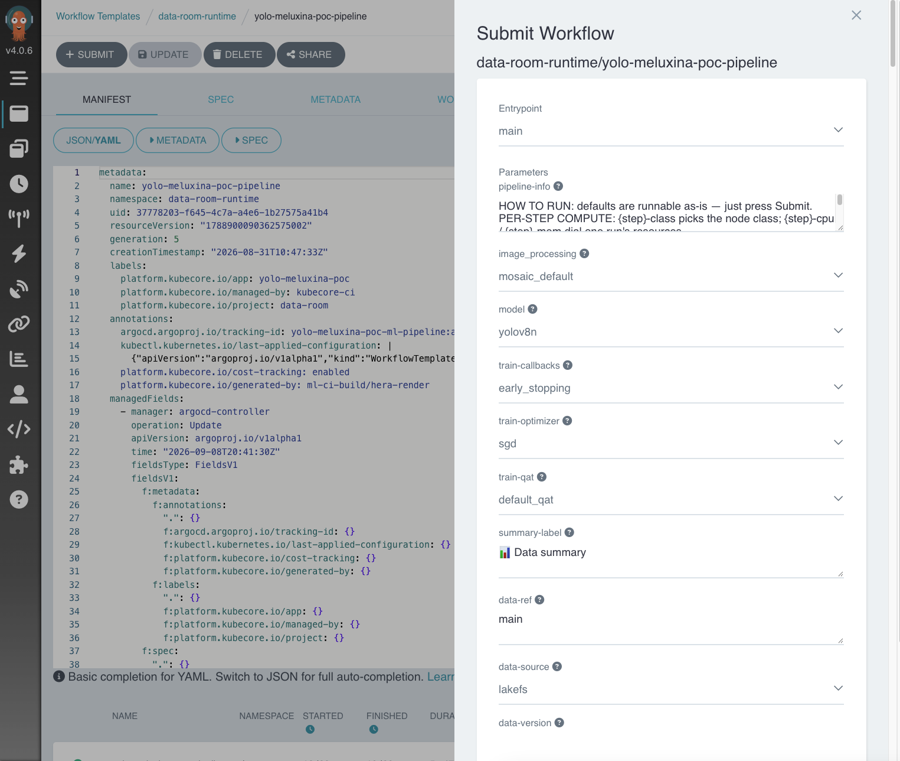
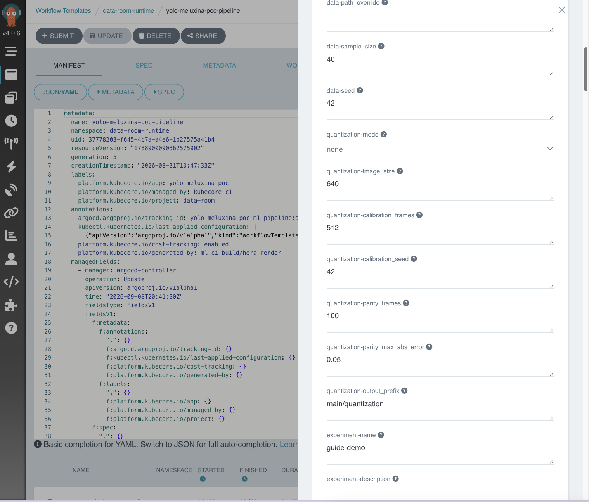

# Run the pipeline

This is the moment it all pays off. You open a web page, set a few fields, and press Submit. The pipeline then trains a model for you.

## Step 1. Open the run page

Your platform contact gives you the link to the run page. It is run by a tool called Argo Workflows. You do not need to learn it. Open the link in your browser.

Find your pipeline in the list. It is named after your project, with `-pipeline` on the end. Click it, then look for the **Submit** button.

## Step 2. The form

When you click Submit, a form opens. It has a lot of fields. Do not let that scare you. **Every field already has a sensible default.** You can press Submit right now and get a normal training run.

So the trick is simple. Change only the few fields you care about, and leave the rest alone.

## Step 3. The fields that matter for a first run

Here are the handful worth setting. Everything else can stay as it is.

| Field | What it does | A good first value |
|---|---|---|
| `experiment-name` | Names your run so you can find it later | something like `my-first-run` |
| `data-ref` | Which dataset to train on | the data ref from the upload step, usually `main` |
| `model` | Which model size to train | `yolov8n` to start. It is the small, fast one |
| `train-epochs` | How many rounds of training | a small number like `10` for your first test |
| `quantization-mode` | Whether to also make a smaller INT8 model | `none` for now |

That is enough for a first run. A small model, a few epochs, no quantization. It finishes quickly and proves the whole thing works end to end.

## Step 4. About the model choices

The `model` field is a dropdown. The options go from small and fast to big and accurate.

- `yolov8n` is the smallest. It trains fastest. Best for a first test.
- `yolov8s` is a middle option.
- `yolov11x` is the largest. It can be more accurate, but it trains much slower and needs more from the machine.

Start small. Move up once you know your dataset works.

## Step 5. Press Submit

When your few fields are set, scroll down and click **Submit**. The page switches to a live view of your run.

That is your part done. The pipeline takes it from here.

## About quantization

For your first runs, leave `quantization-mode` on `none`. The pipeline trains a model and saves it. Simple.

When you are ready for a smaller, faster model, come back and set it to `ptq` or `qat`. That turns on the two extra steps that make an INT8 model. You do not need this to get started.

!!! tip "Wondering which machine it uses?"
    By default training runs on a cluster GPU and you do not pick anything. If you need to choose, or send it to MeluXina, see [Where it trains](where-it-trains.md).

Next, go to [Where it trains](where-it-trains.md), or straight to [Watch it train](watch-it.md).
