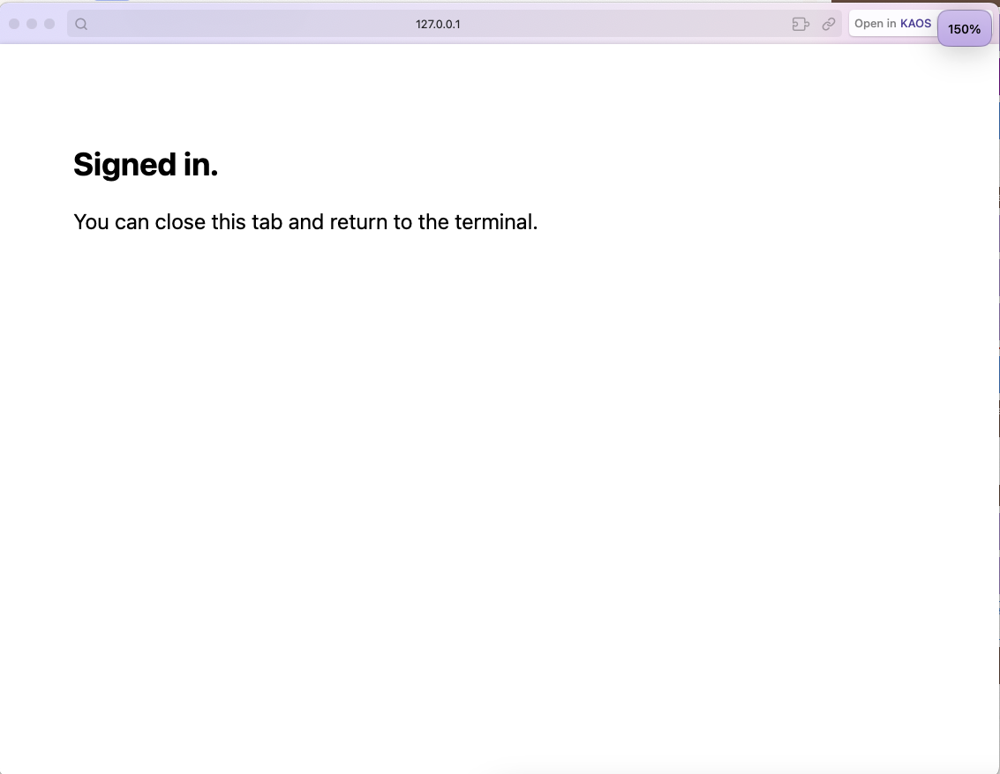
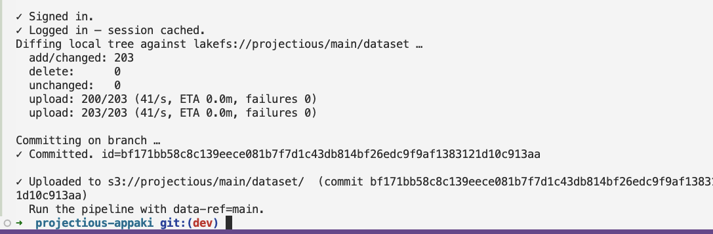
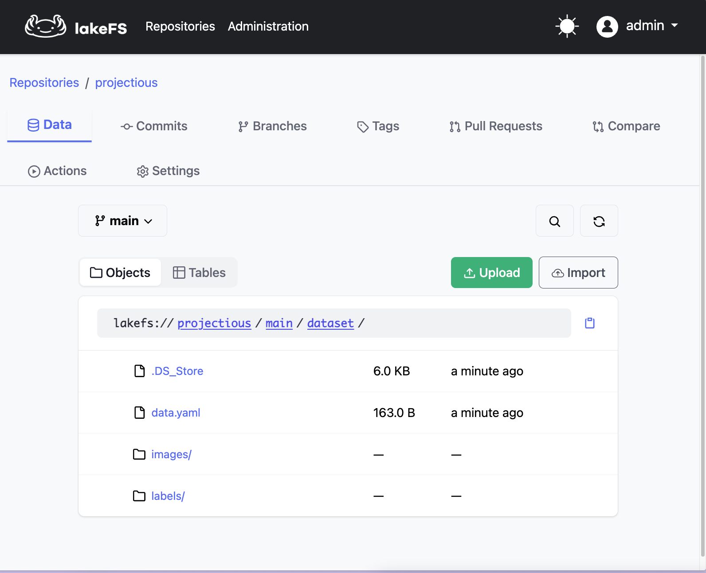

# Upload your dataset

The pipeline trains on a dataset that lives in lakeFS. lakeFS is the storage for your images and labels. This page shows you how to put your dataset there, using the upload tool that ships inside your project.

You do this once per dataset. After it is up, you can run the pipeline on it as many times as you like.

!!! warning "First, you need an app"
    This page assumes you have **already created an app from this template**. The upload tool ships inside that app. If you have not created one yet, do that first, or ask your platform contact. Without an app there is nothing to clone and no lakeFS to upload to.

!!! note "Before you start"
    You need your dataset in the shape from [What you need](what-you-need.md): a `data.yaml`, an `images/` folder, and a `labels/` folder, each split into `train`, `val`, and `test`. That is all. Your app already knows your lakeFS, so you do not need any links or passwords.

## Step 1. Get your app on your computer

Copy your app from GitHub to your computer. This is called cloning, and you do it once. Your platform contact gives you the address.

```bash
git clone https://github.com/<your-org>/<your-app>.git
cd <your-app>
```

Everything else on this page happens inside that folder.

## Step 2. Install the tool

The upload tool is already in your app, in a folder called `dataset_tools`. Install it once.

```bash
pip install ./dataset_tools
```

You only do this the first time.

!!! tip "If you see `command not found: pip`"
    Some computers do not have a bare `pip`. Use one of these instead. They do the same thing.

    ```bash
    python3 -m pip install ./dataset_tools
    # or
    pip3 install ./dataset_tools
    ```

## Step 3. Your lakeFS is already set up

Good news, there is nothing to configure. When your app was created, the platform already wrote your lakeFS link, your repo, and your sign-in settings into a file called `.kubecore/dataset-config.yaml`. You do not open it and you do not edit it. The tool reads it on its own.

So you go straight to the upload.

## Step 4. Start the upload

Run the tool and point it at your dataset folder.

```bash
python3 scripts/upload-dataset.py /path/to/your-dataset
```

Replace `/path/to/your-dataset` with the real folder on your computer. You do not pass any links, the tool already has them. That uploads it as the dataset called `main`.

To keep more than one dataset, give each one a name after the folder. The name is what you will type as `data-ref` when you run.

```bash
python3 scripts/upload-dataset.py /path/to/your-dataset my-cats-v1
```

!!! warning "Same name replaces"
    Uploading again with a name you already used makes that dataset match your folder. Files you do not have on your computer are removed from it. The tool shows you which files and asks before it removes anything. To keep the old one, pick a new name.

## Step 5. Sign in when the browser opens

The first time, the tool opens your web browser and asks you to sign in. This is the same sign in you use for the other pages. Log in, and the browser shows you a short "Signed in" message. Close that tab and go back to the Terminal. The tool remembers you for next time.



## Step 6. Let it upload

Back in the Terminal, the tool checks your dataset, uploads the files, and saves them. You will see it count the files as it goes, then a `Committed` line and a `Uploaded` line. The last line tells you which data ref to use when you run, usually `main`.



## Step 7. Check it in lakeFS

Open the lakeFS link in your browser. You should see your dataset there, with the `data.yaml`, `images`, and `labels` folders. That confirms it landed.



## What to remember

The tool told you a **data ref**. It is the name you gave the dataset, or `main` if you did not give one. Write it down. You will type it into the run form in the next step, so the pipeline knows which dataset to train on.

Next, run the pipeline. Go to [Run the pipeline](run-it.md).

!!! tip "Uploading a new version later"
    To update the dataset, run the same command again with your changed folder. The tool uploads only what changed and keeps a history, so you can always go back.
