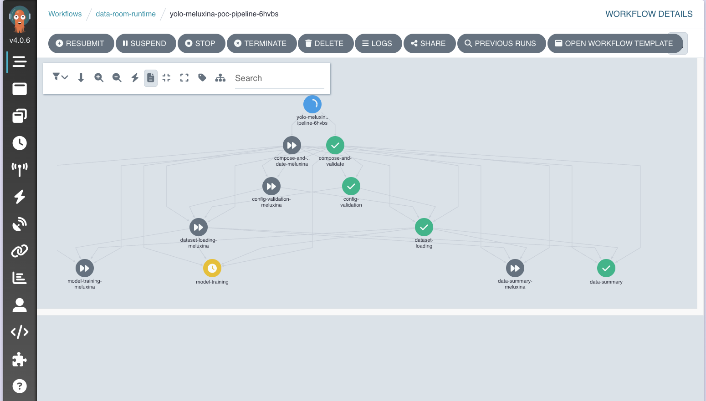
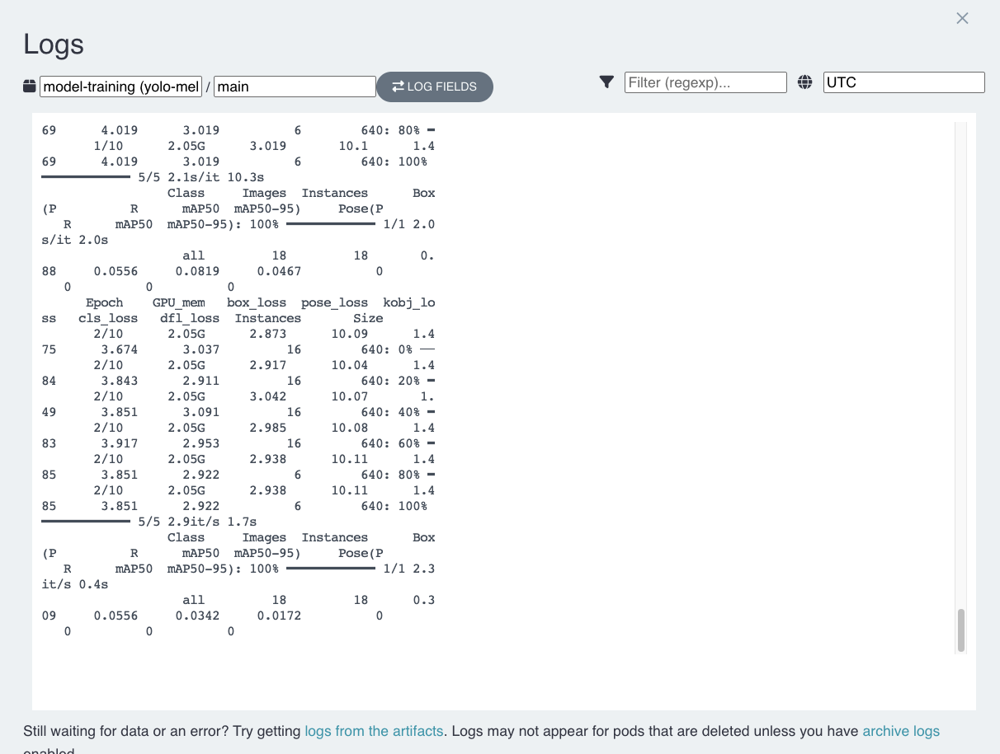
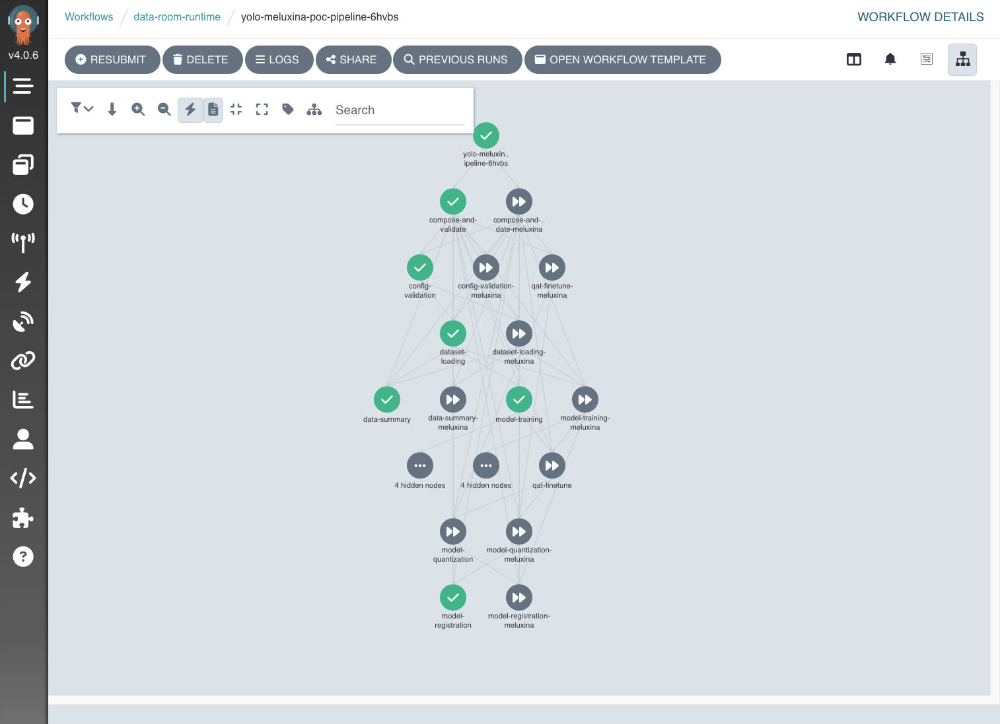

# Watch it train

After you press Submit, the page shows your run as a set of boxes. Each box is one step. You can watch them work through in order.

## Reading the boxes

Each step shows its state with a color.

- A spinning blue box is running.
- A green box with a tick is done.
- A red box means that step failed.
- A grey box that is skipped means a step did not need to run. For example, if you left quantization off, the two quantization steps show as skipped. That is normal.

## How long it takes

- The first two steps, checking settings and loading the dataset, are quick. Seconds to a few minutes.
- Training is the long one. It depends on your model, your epochs, and your dataset. For a first test with a small model and a few epochs, it can be minutes. A full run can take hours.
- The saving step at the end is quick again.

You can close the tab and come back. The run keeps going on the machines. It does not need your browser open.

## If a step turns red

Click the red box. It opens the log for that step. The log shows what the step printed and where it stopped. Read the last several lines first. That is usually where the reason is.

Most early failures are caught by the first step, checking your settings, before any training time is spent. If that happens, the message names what to fix. Change that field on the form and submit again.

## When it finishes

When the last box turns green, your run is done. The trained model is saved, and your numbers and charts are waiting for you.

Next, go read them. Go to [Read your results](results.md).
