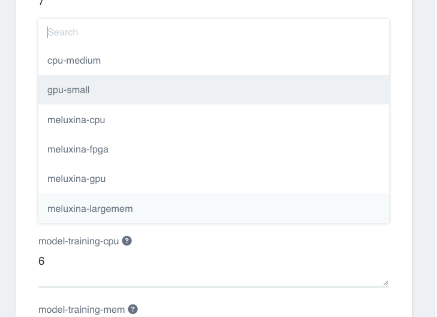

# Where it trains

You may wonder which machine your training runs on. This page explains the choice, in plain words. For most people the answer is "leave it alone, it just works." But the option is there if you need it.

## The default

By default, training runs in your cluster, on a graphics card. You do not choose anything. You press Submit and the training step lands on a GPU. This is the right choice for almost every run.

## The compute class dropdown

Each step on the form has its own dropdown called `<step>-class`, for example `model-training-class`. This picks which kind of machine that step runs on. The options are the machine classes your project was set up with. Your platform contact decides what is in that list.

So the placement is per step. You could put the heavy training step on a big machine and leave the quick steps on small ones. Most of the time the defaults are already sensible, so you can ignore this.

## MeluXina, if your project has it

Some projects are connected to MeluXina, a large supercomputer. If yours is, its machines show up in that same class dropdown, with names that start with `meluxina`. Pick one for the training step and that step runs on MeluXina instead of in the cluster. Every other step stays where it was.

Two things to know about MeluXina.

- There can be a wait. MeluXina is shared, so your step may sit in a queue for a while before it starts. That is normal.
- It only appears if your project is set up for it. If you do not see `meluxina` options, your project is not connected, and that is fine. The cluster GPU works the same way.

## What about GCP

You do not choose GCP. GCP is simply what the cluster runs on underneath. It is not a button on the form. The only real choice you have is the compute class: a cluster machine, or a MeluXina one if it is offered.

## The short version

Leave the class dropdowns alone and training runs on a cluster GPU. That is the normal path. Only touch them if your contact tells you to use a specific class, or if you want to send the training step to MeluXina.

Next, watch it run. Go to [Watch it train](watch-it.md).
